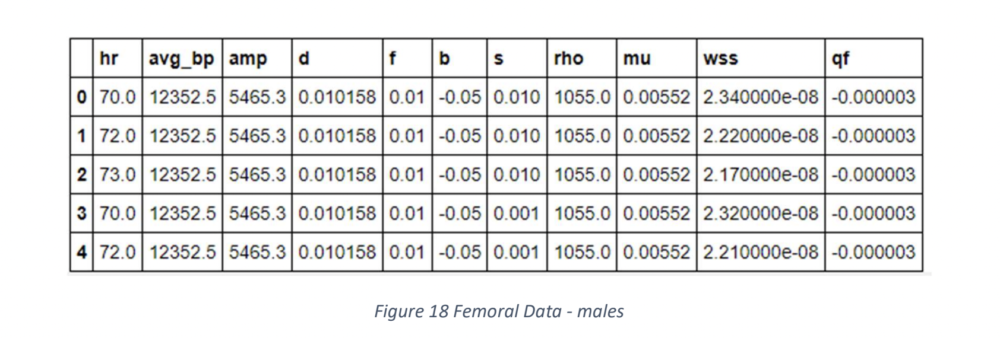

# Blood-Data-analysis
As part of a study project on Machine Learning Techniques for Fluid Mechanics, Autumn '21

The data-set which I worked on has information all about different attributes related blood like 'wall shear strength', 'average blood pressure' and various other important 
attributes that help us decide the health of femoral arteries and evaluate the future heart risk.

The data was collected through collborating with various local hospitals.
To have a rough idea about the data take a look at the foolowing snapshot of the first few rows.

