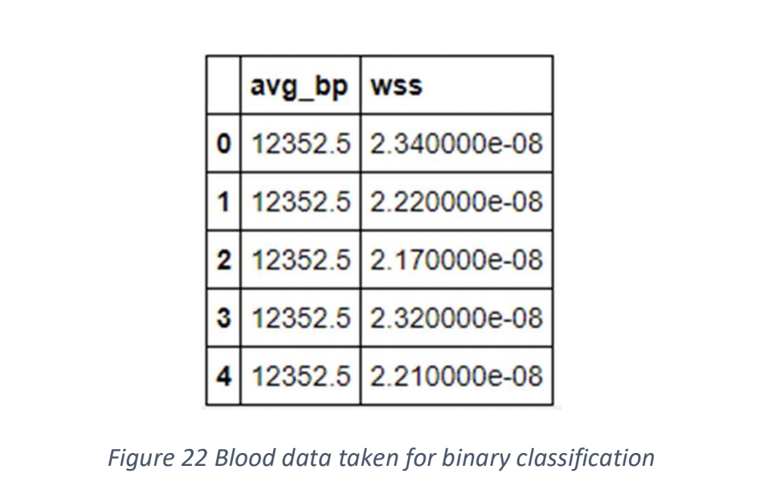

# Blood-Data-analysis
As part of a study project on Machine Learning Techniques for Fluid Mechanics, Autumn '21

The data-set which I worked on has information all about different attributes related blood like 'wall shear strength', 'average blood pressure' and various other important 
attributes that help us decide the health of femoral arteries and evaluate the future heart risk.

The data was collected through collborating with various local hospitals.
To have a rough idea about the data take a look at the foolowing snapshot of the first few rows.

Since wall shear stress is an important factor in detecting flaws in arterial flow,
the given data was made to fit into a linear regression model to make a few
predictions based on a dependent variable taken. For an instance, consider heart
rate to be the independent variable. Discarding other variables, a part of the data
that was made to fit to a linear regression model is as shown.

Whole data is split into testing and training data before fitting to a linear
regression model. Additionally, the scatter plot of the variables taken with the best-fit line is shown
below.

To predict any patterns in the given data, techniques like classification and
clustering algorithms can be helpful. Clustering is an unsupervised learning
method where, the relevant data points are clustered into few groups broadly by
the learning machine using a few algorithms out of which k-means is well
known.
So here, for the data considered, a newly modified data frame is considered.
Again, the independent variable can be considered to be anything, but as an
example average blood pressure is being taken.

The entries for wall shear stress are spread in a close range. To deal with this,
and to turn the data into binary entries, the median of the entries of the entire
column is found out. Thereafter, all the values less than this median value are
labelled as 0 and the values greater as 1.
This data can now directly be made to fit into a logistic regression model. As
usual, the data is split before proceeding. The scatter plot of this binary table
along with the predictions made are shown below.

The theory behind clustering done in data using K-means algorithm.
Fitting this data to a k-means model, we would get an array of under which
cluster does a corresponding entry of wall shear stress fall into. Each cluster is
given a distinctive colour with the corresponding centroid marked with a star.

Through this data analysis we have seen how machine learning techniques
can be useful in analysing the data of real-world applications, which in our case
was a data related to a study on femoral artery. This kind of analysis can help
detect any patterns that would lead to conclusions of risks, effects and causes of
the diseases.
